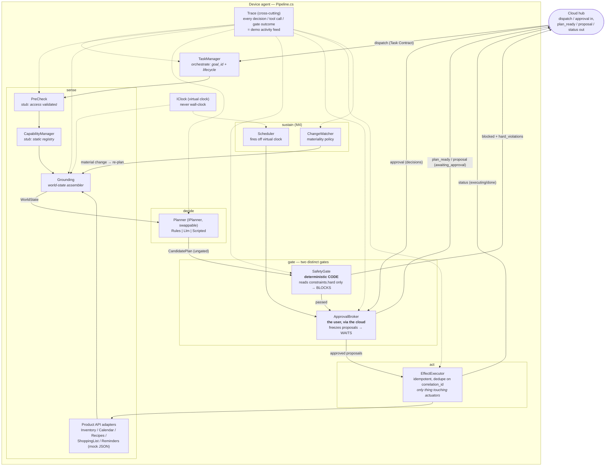
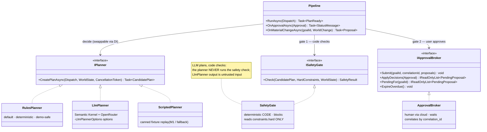

# Diagrams

## 1. Harness pipeline (sense → decide → gate → act → sustain)

```mermaid
flowchart TB
    CLOUD([Cloud hub<br/>dispatch / approval in,<br/>plan_ready / proposal / status out])

    subgraph DEVICE["Device agent — Pipeline.cs"]
        direction TB

        TM["TaskManager<br/><i>orchestrate: goal_id + lifecycle</i>"]

        subgraph SENSE["sense"]
            PC["PreCheck<br/><i>stub: access validated</i>"]
            CM["CapabilityManager<br/><i>stub: static registry</i>"]
            GR["Grounding<br/><i>world-state assembler</i>"]
            ADP["Product API adapters<br/>Inventory / Calendar / Recipes /<br/>ShoppingList / Reminders (mock JSON)"]
        end

        subgraph DECIDE["decide"]
            PL["Planner (IPlanner, swappable)<br/>Rules | Llm | Scripted"]
        end

        subgraph GATE["gate — two distinct gates"]
            SG["SafetyGate<br/><b>deterministic CODE</b><br/>reads constraints.hard only → BLOCKS"]
            AB["ApprovalBroker<br/><b>the user, via the cloud</b><br/>freezes proposals → WAITS"]
        end

        subgraph ACT["act"]
            EE["EffectExecutor<br/>idempotent, dedupe on correlation_id<br/><i>only thing touching actuators</i>"]
        end

        subgraph SUSTAIN["sustain (M4)"]
            SCH["Scheduler<br/>fires off virtual clock"]
            CW["ChangeWatcher<br/>materiality policy"]
        end

        TR["Trace (cross-cutting)<br/>every decision / tool call / gate outcome<br/>= demo activity feed"]
        CLK["IClock (virtual clock)<br/>never wall-clock"]
    end

    CLOUD -- "dispatch (Task Contract)" --> TM
    TM --> PC --> CM --> GR
    ADP --> GR
    GR -- "WorldState" --> PL
    PL -- "CandidatePlan (ungated)" --> SG
    SG -- "passed" --> AB
    SG -- "blocked + hard_violations" --> CLOUD
    AB -- "plan_ready / proposal (awaiting_approval)" --> CLOUD
    CLOUD -- "approval (decisions)" --> AB
    AB -- "approved proposals" --> EE
    EE -- "status (executing/done)" --> CLOUD
    EE --> ADP
    CW -- "material change → re-plan" --> GR
    SCH --> AB
    CLK -.-> SCH
    CLK -.-> GR
    TR -.-> TM & PC & GR & PL & SG & AB & EE & CW
```

## 2. Planner hierarchy + gate separation

```mermaid
classDiagram
    direction TB

    class IPlanner {
        <<interface>>
        +CreatePlanAsync(Dispatch, WorldState, CancellationToken) Task~CandidatePlan~
    }
    class RulesPlanner {
        default · deterministic · demo-safe
    }
    class LlmPlanner {
        Semantic Kernel + OpenRouter
        -LlmPlannerOptions options
    }
    class ScriptedPlanner {
        canned fixture replay (M1 / fallback)
    }
    IPlanner <|.. RulesPlanner
    IPlanner <|.. LlmPlanner
    IPlanner <|.. ScriptedPlanner

    class ISafetyGate {
        <<interface>>
        +Check(CandidatePlan, HardConstraints, WorldState) SafetyResult
    }
    class SafetyGate {
        deterministic CODE · blocks
        reads constraints.hard ONLY
    }
    ISafetyGate <|.. SafetyGate

    class IApprovalBroker {
        <<interface>>
        +Submit(goalId, correlationId, proposals) void
        +ApplyDecisions(Approval) IReadOnlyList~PendingProposal~
        +PendingFor(goalId) IReadOnlyList~PendingProposal~
        +ExpireOverdue() void
    }
    class ApprovalBroker {
        human via cloud · waits
        correlates by correlation_id
    }
    IApprovalBroker <|.. ApprovalBroker

    class Pipeline {
        +RunAsync(Dispatch) Task~PlanReady~
        +OnApprovalAsync(Approval) Task~StatusMessage~
        +OnMaterialChangeAsync(goalId, WorldChange) Task~Proposal~
    }

    Pipeline --> IPlanner : decide (swappable via DI)
    Pipeline --> ISafetyGate : gate 1 — code checks
    Pipeline --> IApprovalBroker : gate 2 — user approves

    note for SafetyGate "LLM plans, code checks:
the planner NEVER runs the safety check;
LlmPlanner output is untrusted input"
```
